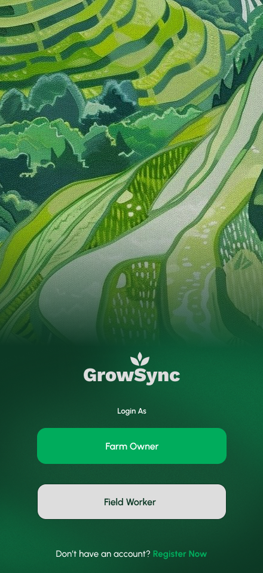

<p align="center">
  
</p>

# GrowSync – Smart Agriculture IoT System UI (UI/UX Case Study)

**GrowSync** is a complete UI/UX design for a smart agriculture system that integrates IoT sensors, real-time environmental monitoring, automated control, and cloud analytics.  

This project showcases the full design lifecycle — **research → system architecture → user flows → high-fidelity UI → dashboard visualization**, all informed by real IoT requirements.

🔗 **[View Figma Prototype](https://www.figma.com/proto/73r9f7dUAbqF3gHYwSBsat/IoT-Assignment-3?page-id=0%3A1&node-id=1-1596&viewport=-179%2C422%2C0.28&t=dFyfo5CnDwfgex8Q-1&scaling=scale-down&content-scaling=fixed&starting-point-node-id=1%3A1585&show-proto-sidebar=1)**
🔗 **[View Figma File]([/docs/Group10_Assessment02%20(1).pdf](https://www.figma.com/design/73r9f7dUAbqF3gHYwSBsat/IoT-Assignment-3?node-id=37-1475&t=A7tQNQqhnlF64R06-1))** 
🔗 **[View IoT Architecture Documentation](/docs/)**  

---

## Overview

GrowSync is designed as an intelligent agriculture solution to help farmers monitor and optimize plant conditions using real-time sensor data. 

The UI focuses on:
- Clear data visualization for **temperature, humidity, pH, gas levels, and pest detection**
- Mobile-friendly dashboard and controls  
- Predictive analytics concepts  
- Easy interaction for non-technical farm users  
- Clean, functional layouts for field monitoring  

---

## Role & Tools

### **My Role**
- UI/UX Designer  
- System flow designer  
- Dashboard architect  
- Prototype creator  

### **Tools Used**
- **Figma** — wireframes, interactive prototype  
- **Draw.io** — system flow diagrams  

---

## Problem / Design Brief

From the IoT documentation, the main problems identified are:

- Farmers lack real-time insights into soil, climate, and pest activity  
- Existing agriculture tech solutions are often expensive or too complex  
- Manual monitoring leads to wasted resources and lower crop yield  
- There is a need for a simple, clear, mobile-friendly dashboard for farmers  

**Design Goal:**  
Create a UI that makes complex IoT data simple, accessible, and actionable — even for users with limited technical experience.

---

## Target Users

- Small to mid-scale farmers  
- Students or researchers studying precision agriculture  
- Users with limited technical expertise  
- Agricultural workers using mobile devices outdoors  
- Anyone needing remote monitoring of farm conditions  

---

## Design Process

### 1. **Research**
- Studied IoT-based farming systems  
- Reviewed documentation on sensor requirements and farming constraints  
- Identified core data categories (pH, humidity, temperature, gas, pests)

### 2. **System Flowcharts**
Created diagrams using Draw.io for:
- Sensor → microcontroller → cloud → dashboard flow  
- Notification triggers  
- Automated control activation  

### 3. **Wireframes**
Focused on:
- Clear information grouping  
- Large tap targets  
- Clean card layout  
- Colour-coded alerts  

### 4. **High-Fidelity UI**
Screens include:
- Dashboard (main sensor overview)  
- Sensor detail pages  
- Actuator controls  
- Real-time charts  
- Alerts & warnings  
- Farm zone selector  

### 5. **Prototype**
- Navigation simulation  
- Sensor updates  
- Alerts  
- Control toggles  

---

## Screens

<p align="center">
  
</p>

---

## Learnings

Through this project, I learned to:

- Convert IoT system requirements into actionable UI elements  
- Visualize real-time sensor data in a clear and friendly way  
- Apply UX principles to technical dashboards  
- Design mobile-first interfaces for field workers  
- Prototype interactive IoT controls and warnings  
- Use colour and layout to highlight critical information  

---

## Next Steps

- Add animated sensor refresh indicators  
- Improve contrast for outdoor usability  
- Create a dark/light mode for day–night farming  
- Add ML prediction screens (based on cloud analytics)  
- Incorporate a farm map with clickable zones  

---

## 📁 File Structure

```
growsync-iot-ui/
├─ README.md
│
├─ components/   # UI buttons and dashboards
├─ design/       # final screens & assets
├─ docs/         # IoT architecture, reports, references
├─ mockup/       
└─ screenshots/   # screenshots from the application
```

---
