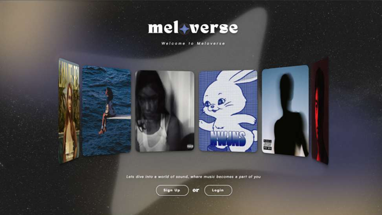
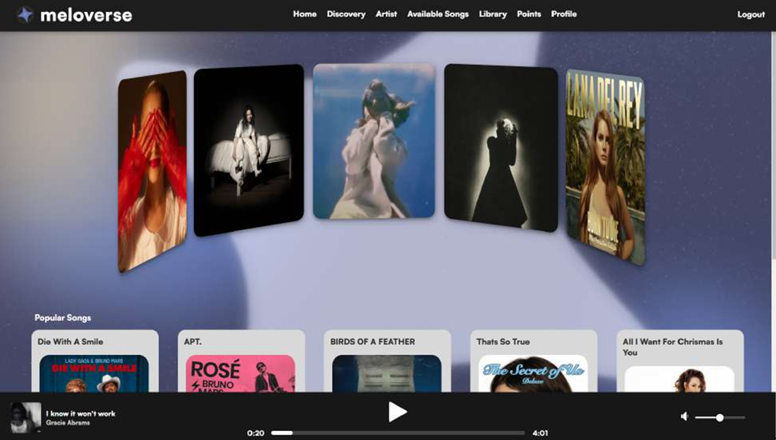
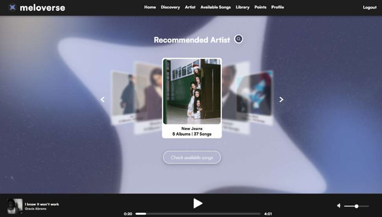
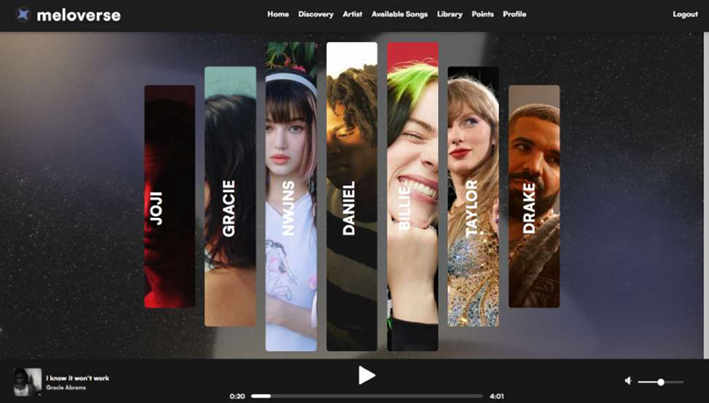
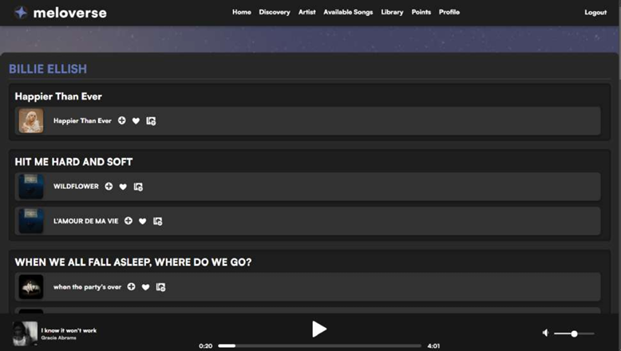
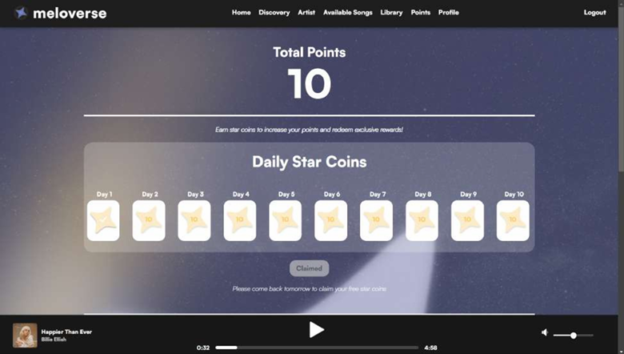

<p align="center">
  
</p>

# Meloverse – Music Streaming Platform (UI/UX Case Study)

**Meloverse** is a personalised, artist-centric music streaming UI that redefines how users connect with the music and artists they love.  
This project showcases the full interface design process: UX research, wireframes, UI design, interactive flows, and final high-fidelity mockups.

🔗 **[Link to Project Code Repository](https://github.com/koclowy/web-development-projects/tree/main/TheArtists)**  🔗 **[View Figma Prototype](https://www.figma.com/design/IDHZJqQhWZOEHGPyAxas78/Project-Meloverse?node-id=62-129&t=Ecqo3ctWAZKjeZFy-1)**  

---

## Overview

Meloverse was designed to solve a core problem in modern music streaming apps:  
**users struggle to form meaningful connections because recommendations feel generic and artist interaction is shallow**  
:contentReference[oaicite:3]{index=3}.

Meloverse focuses on:

- **Artist-centric discovery**  
- **Exclusive updates & merchandise**
- **Gamified rewards system (Points Page)**
- **Immersive UI with a starry-night theme**

The platform provides:

- Landing page  
- Login / Sign Up  
- Home page  
- Discovery page  
- Artist page (bio, albums, tracks, merch)  
- Song page (queue + playback)  
- Points system page  
- Profile & settings  
- Library page  

Screens and descriptions match the prototypes shown in the documentation  
(pages 15–22 for UI examples) :contentReference[oaicite:4]{index=4}.

---

## Role & Tools

### **My Role**
- UI/UX Designer  
- Prototype designer (Figma)  
- UX writer  
- Information architect  
- Layout designer  
- Interaction designer  

### **Tools Used**
- **Figma** – wireframes, UI design, prototype  
- **Procreate** – artwork polishing  
- **Draw.io** – ERD, flow diagrams  
- **Canva** – graphic adjustments  
- **VS Code / NetBeans** – viewed implementation structure  
- **PHP / HTML / CSS / JavaScript** – referenced for behaviour alignment  

---

## Problem / Design Brief

Music platforms today lack emotional connection.  
Meloverse aims to:  

- Center the experience on **favorite artists**  
- Provide **real-time updates** (concerts, news, releases)  
- Offer **exclusive content** (behind-the-scenes, interviews)  
- Build an engaging **reward system**  
- Deliver a **personalised, immersive, starry-night themed UI**  
- Create a space where **music is felt, not just heard**  
:contentReference[oaicite:5]{index=5}.

---

## Target Users

- Music lovers aged **13–35**  
- Fans who want **exclusive artist interaction**  
- Listeners who enjoy **personalised recommendations**  
- Users who like **rewards, collectibles, and gamified systems**  
- Beginners who need a **simple, intuitive interface**  

---

## Design Process

### **1. Research**
- Studied pain points of existing music apps  
- Focused on emotional connection + artist engagement  
- UX references from Spotify, Apple Music, SoundCloud  
- Identified needs for **better personalization**, **exclusive content**, and **artist-fan interaction**

---

### **2. Concepts & Sketches**
- Initial theme: **Starry Night / Galaxy**, symbolizing vast options and personalization  
  (logo explanation in documentation, page 4) :contentReference[oaicite:6]{index=6}  
- Rough layouts:  
  - Home page cards  
  - Discovery carousel  
  - Artist page structure  
  - Points reward UI  

---

### **3. Wireframes**
Created in Figma:
- Landing → Login → Home navigation  
- Library layout  
- Artist bio + albums + tracks + merch  
- Points system grid  
- Recommended artists carousel  

---

### **4. High-Fidelity UI**
Based on the prototypes (pages 15–17) :contentReference[oaicite:7]{index=7}:

- Dark, cosmic palette  
- Soft glows and gradients  
- Floating card UI  
- Circular vinyl-styled player  
- Consistent top navigation bar  
- Fixed footer music controls  

---

### **5. Prototype**
Built using Figma interactions:
- Card → detail page navigation  
- Discovery carousel arrows  
- Add to queue / add to liked interactions  
- Points Claim animation  
- Artist content reveal  

---

## Screens

### **Landing + Home**
<p align="center">
  
  
</p>

### **Discovery + Artist Page**
<p align="center">
  
  
</p>

### **Song Page + Points Page**
<p align="center">
  
  
</p>

---

## Learnings

From Meloverse, I learned:

- How to structure a full streaming platform UI  
- Designing **artist-centric** interfaces  
- Incorporating **gamification** in UI/UX  
- Improving data flow communication (UI ↔ database features)  
- Creating visually cohesive multi-page ecosystems  
- Balancing aesthetic appeal with usability  
- Building smooth, interactive prototypes  
- Designing for emotional engagement  

---

## Next Steps

Future improvements:

- Add micro-interactions & motion design  
- Improve readability & spacing on Artist Pages  
- Add custom themes (light/dark/galaxy variations)  
- Add social sharing UI  
- Expand points system rewards  
- Improve mobile responsiveness  

---

## File Structure
```
meloverse-music-platform-ui/
├─ README.md
│
├─ design/        # High-fidelity screens & Figma exports
├─ docs/          # Documentation & proposals
├─ other designs/ # Other concepts
└─ screenshots/   # Screenshots used in README
```
---

