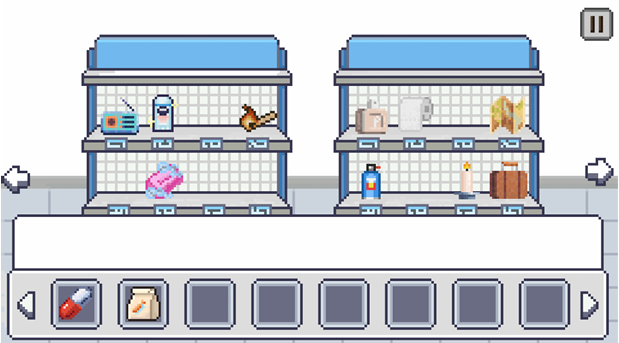
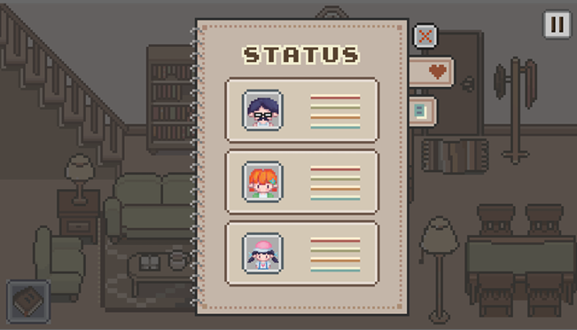

# ⏱️ OneMinute – Survival Strategy Game (UI/UX Case Study)

**OneMinute** is a survival strategy game UI inspired by navigating a pandemic lockdown.  
This project showcases the complete interface design process — from concept sketches and hand-drawn artwork to final UI layouts and interactions implemented in JavaFX.

🔗 **[Link to Game Code Respository](https://github.com/koclowy/java-projects/tree/main/Advanced%20Programming/oneminute)**

---

## 🎨 Overview

OneMinute is a game interface designed to immerse players in managing a family’s survival during a 30-day lockdown. The UI blends **pixel-art aesthetics**, **hand-drawn illustrations**, and **JavaFX functionality** to create an emotionally engaging experience.

The UI flow includes:
- Login & Register screens  
- Story introduction  
- Shopping (60-second timer)  
- Cashier review  
- Lockdown home screen  
- Journal choices (daily events)  
- Survival status UI  
- Win / Defeat screens  

---

## 🧑‍💻 Role & Tools

### **My Role**
- UI/UX Designer  
- Illustrator (all characters, icons & backgrounds hand-drawn)  
- Interaction designer  
- Prototype creator  

### **Tools Used**
- **Procreate** – character art, backgrounds, UI sketches  
- **Pixel Studio** – pixel-style UI assets  
- **Figma** – wireframes, UI layout, prototype  
- **Draw.io** – flowcharts & navigation diagrams  
- **Canva** – simple graphic adjustments  
- **VS Code / NetBeans** – checking how UI integrates with JavaFX  

---

## 📝 Problem / Design Brief

During the pandemic, people struggled with resource management, anxiety, and uncertain decision-making.  
**The goal:**  
Create a UI that simulates the emotional and strategic pressure of surviving a lockdown — while keeping the experience accessible, playable, and visually engaging.

The UI must:
- Communicate survival urgency  
- Show stats clearly (health, hunger, thirst, morale)  
- Support daily decision-making  
- Present randomized events in journal format  
- Fit naturally with the game’s pixel-art storytelling  

---

## 🎯 Target Users

- **Casual players** who enjoy survival and narrative games  
- **Students/Educators** studying pandemic decision-making  
- **Players aged 14–30** who like pixel art, strategy, and simulation  
- Anyone who wants an immersive, simple gameplay experience with emotional stakes  

---

## 🧪 Design Process

### 1. **Research**
- Collected references from survival games (60 Seconds!, Sheltered)
- Studied how games display limited resources & consequences
- Identified emotional tone → tense, cozy, gloomy depending on scene  

### 2. **Sketches & Early Concepts**
- Rough sketches in Procreate  
- Character moods: normal, sick, dead  
- Scene structure: shelves → cashier → living room → journals  

### 3. **Wireframes (Figma)**
Focused on:
- Consistent navigation  
- Information hierarchy  
- Journal → Decisions → Status update  

### 4. **High-fidelity UI**
- Pixel-art environment  
- Warm colours for home scenes  
- Bright colours for shopping phase  
- Dark, dramatic tones for defeat screen  

### 5. **Prototype**
Built clickable prototype in Figma with:
- Screen transitions  
- Button interactions  
- Day progression flow  

---

## 🖼 Screens

> Add your exported screens to:  
> `oneminute-survival-game-ui/screenshots/`

```html
<p align="center">
  
  
</p>

<p align="center">
  
  
</p>

